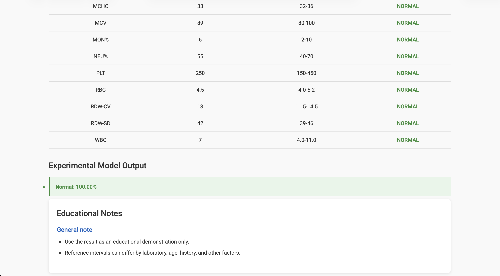

# Blood Report ML Analyzer

This is a small end-to-end machine-learning project I built to explore how structured blood-test values can be processed in a web application. The app combines simple reference-range checks with a multi-label Random Forest model and serves the result through Flask.

The project uses synthetic data. It is a portfolio and learning project, not a clinical system, and its output should not be used for diagnosis or treatment decisions.

## What the project does

A user can enter basic blood-test values in the browser. The Flask backend validates the input, compares each value with the reference ranges used by the project, prepares the same features used during training, and runs the trained classifier. The results page shows the range checks and any high-confidence model labels returned by the demo model.

```text
Browser input
     |
     v
Flask API
     |
     +--> reference-range checks
     |
     +--> preprocessing --> Random Forest model
     |
     v
results page
```
## Application Preview

The Flask interface accepts structured blood-test values, compares them with the project reference ranges, and displays the experimental model output alongside educational notes.



## Stack

- Python
- Flask
- pandas / NumPy
- scikit-learn
- HTML, CSS and JavaScript
- pytest

## Repository layout

```text
.
├── app.py                 Flask entry point
├── src/                   analysis, validation and model code
├── models/                trained model artifacts
├── data/synthetic/        generated datasets used by the project
├── notebooks/             data generation and model training
├── tests/                 lightweight unit and API tests
├── docs/                  short architecture notes
├── templates/             Flask templates
└── static/                CSS, JavaScript and images
```

## Run it locally

Python 3.11 is recommended because it is compatible with the versions used when the model artifacts were created.

```bash
python3 -m venv .venv
source .venv/bin/activate
pip install -r requirements.txt
python app.py
```

Open `http://127.0.0.1:5000` in a browser.

To run the tests:

```bash
pip install -r requirements-dev.txt
pytest
```

## Data and model

The synthetic dataset is generated in `notebooks/01_generate_synthetic_data.ipynb`. The training notebook builds labels from the project's reference rules and trains a multi-output Random Forest classifier.

The web app currently uses a probability threshold of `0.90` before displaying a model label. That threshold is a conservative demo setting rather than a clinically validated cutoff and can be changed with the `ML_PREDICTION_THRESHOLD` environment variable.

## Model check

The training notebook records an exact-match test accuracy of `0.953` and a Hamming loss of `0.00132` on its synthetic holdout set. Those numbers need context: the labels are generated from rules applied to synthetic data, so the result mostly shows that the classifier learned the constructed rule patterns. It is not evidence of clinical performance.

## Limitations

- Training data is synthetic and generated from hand-written distributions and rules.
- Several model labels are derived from the same rules used to generate the synthetic examples, so performance does not represent real-world clinical performance.
- Reference intervals vary between laboratories and populations.
- The model artifacts are included so the demo runs locally, but they are relatively large and would normally be stored outside Git in a production workflow.
- This project has not been clinically validated.

## Why I keep this project

The useful part of this project for me is the complete workflow: data generation, preprocessing, multi-label classification, model serialization, API integration, browser-side interaction and basic testing. It also gave me a clear example of why strong validation and careful claims matter when machine learning is applied to health-related data.
